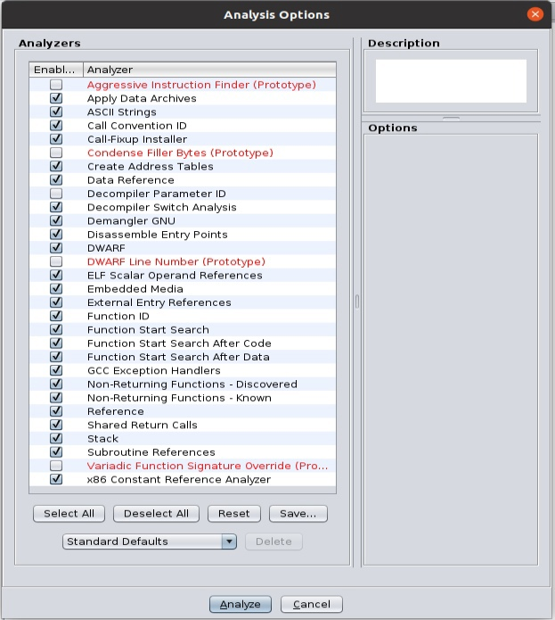

# Защита программ и данных

## Задание 2 

## Формулировка

Дизассемблировать предложенную программу и восстановить алгоритм работы. После восстановления алгоритма написать программу «кейген» для генерации пароля (ключа) по введённым данным. Составить отчёт по проведённым исследованиям. 

Предложенная программа - PZ2.

## Используемые средства

[Ghidra 10.0.1](https://github.com/NationalSecurityAgency/ghidra/releases/download/Ghidra_10.0.1_build/ghidra_10.0.1_PUBLIC_20210708.zip)

Operating System: Ubuntu 20.04.3 LTS

Kernel: Linux 5.11.0-38-generic

Architecture: x86-64

## Применение инструментов Ghidra
Добавляем исполняемый файл в проект и запускаем:


Применяем стандарные средства анализа:


Далее, среди функций находим функцию main:


Получаем дезассемблированную программу, которую далее анализируем. В конце отчета предоставлен полный код анализируемого файла, однако для упрощения пояснений к алгоритму будут демонстрироваться основные значимые части.

В первой части программы создается список из 7 имен забаненных пользователей (`banlist`):

```C++
  long in_FS_OFFSET;
  initializer_list<std--__cxx11--basic_string<char,std--char_traits<char>,std--allocator<char>>>
  in_stack_fffffffffffffe48;
  ...
  iterator local_198;
  ...
  set<std--__cxx11--basic_string<char,std--char_traits<char>,std--allocator<char>>,std--less<std--__cxx11--basic_string<char,std--char_traits<char>,std--allocator<char>>>,std--allocator<std--__cxx11--basic_string<char,std--char_traits<char>,std--allocator<char>>>>
  banlist;
  string name;
  basic_string<char,std--char_traits<char>,std--allocator<char>> local_f8;
  basic_string<char,std--char_traits<char>,std--allocator<char>> local_d8;
  basic_string<char,std--char_traits<char>,std--allocator<char>> local_b8;
  basic_string<char,std--char_traits<char>,std--allocator<char>> local_98;
  basic_string<char,std--char_traits<char>,std--allocator<char>> local_78;
  basic_string<char,std--char_traits<char>,std--allocator<char>> local_58;
  size_type local_30;
  
  local_30 = *(size_type *)(in_FS_OFFSET + 0x28);
  std::allocator<char>::allocator();
                    /* try { // try from 0010234f to 00102353 has its CatchHandler @ 001029ea */
  std::__cxx11::basic_string<char,std--char_traits<char>,std--allocator<char>>::basic_string<>
            ((basic_string<char,std--char_traits<char>,std--allocator<char>> *)&name,"Kirill",
             (allocator<char> *)&stack0xfffffffffffffe55);
  std::allocator<char>::allocator();
                    /* try { // try from 00102382 to 00102386 has its CatchHandler @ 001029d6 */
  std::__cxx11::basic_string<char,std--char_traits<char>,std--allocator<char>>::basic_string<>
            (&local_f8,"Alisa",(allocator<char> *)&stack0xfffffffffffffe56);
  std::allocator<char>::allocator();
                    /* try { // try from 001023b5 to 001023b9 has its CatchHandler @ 001029c2 */
  std::__cxx11::basic_string<char,std--char_traits<char>,std--allocator<char>>::basic_string<>
            (&local_d8,"Renat",(allocator<char> *)&stack0xfffffffffffffe57);
  std::allocator<char>::allocator();
                    /* try { // try from 001023e8 to 001023ec has its CatchHandler @ 001029ae */
  std::__cxx11::basic_string<char,std--char_traits<char>,std--allocator<char>>::basic_string<>
            (&local_b8,"Yura",(allocator<char> *)&i);
  std::allocator<char>::allocator();
                    /* try { // try from 0010241e to 00102422 has its CatchHandler @ 0010299a */
  std::__cxx11::basic_string<char,std--char_traits<char>,std--allocator<char>>::basic_string<>
            (&local_98,"Denis",(allocator<char> *)&j);
  std::allocator<char>::allocator();
                    /* try { // try from 00102454 to 00102458 has its CatchHandler @ 00102986 */
  std::__cxx11::basic_string<char,std--char_traits<char>,std--allocator<char>>::basic_string<>
            (&local_78,"Alex",(allocator<char> *)&it);
  std::allocator<char>::allocator();
                    /* try { // try from 0010248a to 0010248e has its CatchHandler @ 00102972 */
  std::__cxx11::basic_string<char,std--char_traits<char>,std--allocator<char>>::basic_string<>
            (&local_58,"kolyavv",(allocator<char> *)&local_198);
  ...
  std::
  set<std--__cxx11--basic_string<char,std--char_traits<char>,std--allocator<char>>,std--less<std--__cxx11--basic_string<char,std--char_traits<char>,std--allocator<char>>>,std--allocator<std--__cxx11--basic_string<char,std--char_traits<char>,std--allocator<char>>>>
  ::set(&banlist,in_stack_fffffffffffffe48,
        (less<std--__cxx11--basic_string<char,std--char_traits<char>,std--allocator<char>>> *)&name,
        (allocator_type *)0x7);
```

Далее запрашивается имя пользователя (`name`):

```C++
  std::operator<<((basic_ostream *)std::cout,"Greetings! Please, enter your name:\n");
  std::__cxx11::basic_string<char,std--char_traits<char>,std--allocator<char>>::basic_string
            ((basic_string<char,std--char_traits<char>,std--allocator<char>> *)&name);
                    /* try { // try from 001025b3 to 001025e7 has its CatchHandler @ 00102a2a */
  std::operator>>((basic_istream *)std::cin,(basic_string *)&name);
```

В булеву переменную `bVar1` записывается результат проверки списка забаненных пользователей (`banlist`) на наличие введенного имени (`name`).

Если пользователь не забанен, в цикле имя записывается в буфер `scnd`:

```C++
  bVar1 = std::
          set<std--__cxx11--basic_string<char,std--char_traits<char>,std--allocator<char>>,std--less<std--__cxx11--basic_string<char,std--char_traits<char>,std--allocator<char>>>,std--allocator<std--__cxx11--basic_string<char,std--char_traits<char>,std--allocator<char>>>>
          ::contains(&banlist,(key_type *)&name);
  if (bVar1 == false) {
    std::vector<char,std--allocator<char>>::vector(&fst);
    std::vector<char,std--allocator<char>>::vector(&scnd);
    i = 0x3f2;
    j = 0;
    it = (char *)std::__cxx11::basic_string<char,std--char_traits<char>,std--allocator<char>>::begin
                           ((basic_string<char,std--char_traits<char>,std--allocator<char>> *)&name)
    ;
    while( true ) {
      local_198 = (char *)std::__cxx11::
                          basic_string<char,std--char_traits<char>,std--allocator<char>>::end
                                    ((basic_string<char,std--char_traits<char>,std--allocator<char>>
                                      *)&name);
      bVar1 = __gnu_cxx::operator==<char*,char*,std--__cxx11--basic_string<char>>
                        (&it,(__normal_iterator<char*,std--__cxx11--basic_string<char,std--char_traits<char>,std--allocator<char>>>
                              *)&local_198);
      if (bVar1 == true) break;
      if ((j & 1U) == 0) {
        pcVar2 = __gnu_cxx::
                 __normal_iterator<char*,std--__cxx11--basic_string<char,std--char_traits<char>,std--allocator<char>>>
                 ::operator*(&it);
        std::vector<char,std--allocator<char>>::push_back(&scnd,pcVar2);
      }
      else {
        ...
      }
      __gnu_cxx::
      __normal_iterator<char*,std--__cxx11--basic_string<char,std--char_traits<char>,std--allocator<char>>>
      ::operator++(&it);
    }
```

А затем в первый элемент целочисленного массива `p_i` записывается число 1010 (i = 0x3f2), и в цикле к нему прибавляются ASCII-коды символов имени пользователя (буфер `scnd`). После цикла к получившемуся числу вновь прибавляется 1010, результат вычисления сохраняется в целочисленной переменной `i`:

```C++
    p_i = (int *)operator.new(4);
    *p_i = i;
    ...
    it = (char *)std::vector<char,std--allocator<char>>::begin(&scnd);
    while( true ) {
      local_198 = (char *)std::vector<char,std--allocator<char>>::end(&scnd);
      bVar1 = __gnu_cxx::operator==<char*,char*,std--vector<char>>
                        ((__normal_iterator<char*,std--vector<char,std--allocator<char>>> *)&it,
                         (__normal_iterator<char*,std--vector<char,std--allocator<char>>> *)
                         &local_198);
      if (bVar1 == true) break;
      pcVar3 = __gnu_cxx::__normal_iterator<char*,std--vector<char,std--allocator<char>>>::operator*
                         ((__normal_iterator<char*,std--vector<char,std--allocator<char>>> *)&it);
      *p_i = *p_i + (int)*pcVar3;
      __gnu_cxx::__normal_iterator<char*,std--vector<char,std--allocator<char>>>::operator++
                ((__normal_iterator<char*,std--vector<char,std--allocator<char>>> *)&it);
    }
    *p_i = *p_i + i;
    i = *p_i;
```

Запрашивается ввод кода пользователя, если введенный код совпал с ранее вычисленным, выводится приветствие пользователя, иначе выводится сообщение о неверном ответе:

```C++
    std::operator<<((basic_ostream *)std::cout,"Enter your code:\n");
    std::basic_istream<char,std::char_traits<char>>::operator>>
              ((basic_istream<char,std::char_traits<char>> *)std::cin,&j);
    bVar1 = j != i;
    if (bVar1) {
      std::operator<<((basic_ostream *)std::cout,"Wrong answer\n");
    }
    else {
      pbVar4 = std::operator<<((basic_ostream *)std::cout,"Hello, ");
      pbVar4 = std::operator<<(pbVar4,(basic_string *)&name);
      std::operator<<(pbVar4,"!\n");
    }
```

Если же имя пользователя оказалось в `banlist`, выводится сообщение: "You were banned for watching pictures of naked american fuzzy lops":

```C++
  else {
    std::operator<<((basic_ostream *)std::cout,
                    "You were banned for watching pictures of naked american fuzzy lops\n");
```

### Короткое описание алгоритма вычисления кода пользователя

Код пользователя формируется по следующей формуле: $$1010+\sum_{char \in name} ASCII(char) + 1010$$, однако для имен: "Kirill", "Alisa", "Renat", "Yura", "Denis", "Alex", "kolyavv", ключ сгенерировать нельзя.

По этой формуле можно написать кейген, реализован на языке python (keygen.ipynb):

```Python
def keygen(name):
    banlist = ["Kirill", "Alisa", "Renat", "Yura", "Denis", "Alex", "kolyavv"]
    key = 2*1010
    if name in banlist:
        return "You are banned, " + name + ", sorry, no key :("
    for ch in name:
        key += ord(ch)
    return "Your key is: " + str(key) + ", " + name + "!"

print("Enter your name: ")
name = input()
print(keygen(name))
```

### Результат декомпиляции функции main
```C++

int main(void)

{
  bool bVar1;
  reference pcVar2;
  reference pcVar3;
  basic_ostream *pbVar4;
  uint uVar5;
  basic_string<char,std--char_traits<char>,std--allocator<char>> *this;
  long in_FS_OFFSET;
  initializer_list<std--__cxx11--basic_string<char,std--char_traits<char>,std--allocator<char>>>
  in_stack_fffffffffffffe48;
  int i;
  int j;
  __normal_iterator<char*,std--__cxx11--basic_string<char,std--char_traits<char>,std--allocator<char>>>
  it;
  iterator local_198;
  int *p_i;
  vector<char,std--allocator<char>> fst;
  vector<char,std--allocator<char>> scnd;
  set<std--__cxx11--basic_string<char,std--char_traits<char>,std--allocator<char>>,std--less<std--__cxx11--basic_string<char,std--char_traits<char>,std--allocator<char>>>,std--allocator<std--__cxx11--basic_string<char,std--char_traits<char>,std--allocator<char>>>>
  banlist;
  string name;
  basic_string<char,std--char_traits<char>,std--allocator<char>> local_f8;
  basic_string<char,std--char_traits<char>,std--allocator<char>> local_d8;
  basic_string<char,std--char_traits<char>,std--allocator<char>> local_b8;
  basic_string<char,std--char_traits<char>,std--allocator<char>> local_98;
  basic_string<char,std--char_traits<char>,std--allocator<char>> local_78;
  basic_string<char,std--char_traits<char>,std--allocator<char>> local_58;
  size_type local_30;
  
  local_30 = *(size_type *)(in_FS_OFFSET + 0x28);
  std::allocator<char>::allocator();
                    /* try { // try from 0010234f to 00102353 has its CatchHandler @ 001029ea */
  std::__cxx11::basic_string<char,std--char_traits<char>,std--allocator<char>>::basic_string<>
            ((basic_string<char,std--char_traits<char>,std--allocator<char>> *)&name,"Kirill",
             (allocator<char> *)&stack0xfffffffffffffe55);
  std::allocator<char>::allocator();
                    /* try { // try from 00102382 to 00102386 has its CatchHandler @ 001029d6 */
  std::__cxx11::basic_string<char,std--char_traits<char>,std--allocator<char>>::basic_string<>
            (&local_f8,"Alisa",(allocator<char> *)&stack0xfffffffffffffe56);
  std::allocator<char>::allocator();
                    /* try { // try from 001023b5 to 001023b9 has its CatchHandler @ 001029c2 */
  std::__cxx11::basic_string<char,std--char_traits<char>,std--allocator<char>>::basic_string<>
            (&local_d8,"Renat",(allocator<char> *)&stack0xfffffffffffffe57);
  std::allocator<char>::allocator();
                    /* try { // try from 001023e8 to 001023ec has its CatchHandler @ 001029ae */
  std::__cxx11::basic_string<char,std--char_traits<char>,std--allocator<char>>::basic_string<>
            (&local_b8,"Yura",(allocator<char> *)&i);
  std::allocator<char>::allocator();
                    /* try { // try from 0010241e to 00102422 has its CatchHandler @ 0010299a */
  std::__cxx11::basic_string<char,std--char_traits<char>,std--allocator<char>>::basic_string<>
            (&local_98,"Denis",(allocator<char> *)&j);
  std::allocator<char>::allocator();
                    /* try { // try from 00102454 to 00102458 has its CatchHandler @ 00102986 */
  std::__cxx11::basic_string<char,std--char_traits<char>,std--allocator<char>>::basic_string<>
            (&local_78,"Alex",(allocator<char> *)&it);
  std::allocator<char>::allocator();
                    /* try { // try from 0010248a to 0010248e has its CatchHandler @ 00102972 */
  std::__cxx11::basic_string<char,std--char_traits<char>,std--allocator<char>>::basic_string<>
            (&local_58,"kolyavv",(allocator<char> *)&local_198);
  std::allocator<std--__cxx11--basic_string<char,std--char_traits<char>,std--allocator<char>>>::
  allocator((allocator<std--__cxx11--basic_string<char,std--char_traits<char>,std--allocator<char>>>
             *)&scnd);
                    /* try { // try from 001024db to 001024df has its CatchHandler @ 00102930 */
  std::
  set<std--__cxx11--basic_string<char,std--char_traits<char>,std--allocator<char>>,std--less<std--__cxx11--basic_string<char,std--char_traits<char>,std--allocator<char>>>,std--allocator<std--__cxx11--basic_string<char,std--char_traits<char>,std--allocator<char>>>>
  ::set(&banlist,in_stack_fffffffffffffe48,
        (less<std--__cxx11--basic_string<char,std--char_traits<char>,std--allocator<char>>> *)&name,
        (allocator_type *)0x7);
  std::allocator<std--__cxx11--basic_string<char,std--char_traits<char>,std--allocator<char>>>::
  ~allocator((allocator<std--__cxx11--basic_string<char,std--char_traits<char>,std--allocator<char>>>
              *)&scnd);
  this = (basic_string<char,std--char_traits<char>,std--allocator<char>> *)&stack0xffffffffffffffc8;
  while (this != (basic_string<char,std--char_traits<char>,std--allocator<char>> *)&name) {
    this = this + -1;
    std::__cxx11::basic_string<char,std--char_traits<char>,std--allocator<char>>::~basic_string
              (this);
  }
  std::allocator<char>::~allocator((allocator<char> *)&local_198);
  std::allocator<char>::~allocator((allocator<char> *)&it);
  std::allocator<char>::~allocator((allocator<char> *)&j);
  std::allocator<char>::~allocator((allocator<char> *)&i);
  std::allocator<char>::~allocator((allocator<char> *)&stack0xfffffffffffffe57);
  std::allocator<char>::~allocator((allocator<char> *)&stack0xfffffffffffffe56);
  std::allocator<char>::~allocator((allocator<char> *)&stack0xfffffffffffffe55);
                    /* try { // try from 0010258e to 00102592 has its CatchHandler @ 00102a3e */
  std::operator<<((basic_ostream *)std::cout,"Greetings! Please, enter your name:\n");
  std::__cxx11::basic_string<char,std--char_traits<char>,std--allocator<char>>::basic_string
            ((basic_string<char,std--char_traits<char>,std--allocator<char>> *)&name);
                    /* try { // try from 001025b3 to 001025e7 has its CatchHandler @ 00102a2a */
  std::operator>>((basic_istream *)std::cin,(basic_string *)&name);
  bVar1 = std::
          set<std--__cxx11--basic_string<char,std--char_traits<char>,std--allocator<char>>,std--less<std--__cxx11--basic_string<char,std--char_traits<char>,std--allocator<char>>>,std--allocator<std--__cxx11--basic_string<char,std--char_traits<char>,std--allocator<char>>>>
          ::contains(&banlist,(key_type *)&name);
  if (bVar1 == false) {
    std::vector<char,std--allocator<char>>::vector(&fst);
    std::vector<char,std--allocator<char>>::vector(&scnd);
    i = 0x3f2;
    j = 0;
    it = (char *)std::__cxx11::basic_string<char,std--char_traits<char>,std--allocator<char>>::begin
                           ((basic_string<char,std--char_traits<char>,std--allocator<char>> *)&name)
    ;
    while( true ) {
      local_198 = (char *)std::__cxx11::
                          basic_string<char,std--char_traits<char>,std--allocator<char>>::end
                                    ((basic_string<char,std--char_traits<char>,std--allocator<char>>
                                      *)&name);
      bVar1 = __gnu_cxx::operator==<char*,char*,std--__cxx11--basic_string<char>>
                        (&it,(__normal_iterator<char*,std--__cxx11--basic_string<char,std--char_traits<char>,std--allocator<char>>>
                              *)&local_198);
      if (bVar1 == true) break;
      if ((j & 1U) == 0) {
        pcVar2 = __gnu_cxx::
                 __normal_iterator<char*,std--__cxx11--basic_string<char,std--char_traits<char>,std--allocator<char>>>
                 ::operator*(&it);
        std::vector<char,std--allocator<char>>::push_back(&scnd,pcVar2);
      }
      else {
        pcVar2 = __gnu_cxx::
                 __normal_iterator<char*,std--__cxx11--basic_string<char,std--char_traits<char>,std--allocator<char>>>
                 ::operator*(&it);
                    /* try { // try from 0010269c to 001028d4 has its CatchHandler @ 00102a07 */
        std::vector<char,std--allocator<char>>::push_back(&fst,pcVar2);
      }
      __gnu_cxx::
      __normal_iterator<char*,std--__cxx11--basic_string<char,std--char_traits<char>,std--allocator<char>>>
      ::operator++(&it);
    }
    p_i = (int *)operator.new(4);
    *p_i = i;
    it = (char *)std::vector<char,std--allocator<char>>::begin(&fst);
    while( true ) {
      local_198 = (char *)std::vector<char,std--allocator<char>>::end(&fst);
      bVar1 = __gnu_cxx::operator==<char*,char*,std--vector<char>>
                        ((__normal_iterator<char*,std--vector<char,std--allocator<char>>> *)&it,
                         (__normal_iterator<char*,std--vector<char,std--allocator<char>>> *)
                         &local_198);
      if (bVar1 == true) break;
      pcVar3 = __gnu_cxx::__normal_iterator<char*,std--vector<char,std--allocator<char>>>::operator*
                         ((__normal_iterator<char*,std--vector<char,std--allocator<char>>> *)&it);
      *p_i = *p_i + (int)*pcVar3;
      __gnu_cxx::__normal_iterator<char*,std--vector<char,std--allocator<char>>>::operator++
                ((__normal_iterator<char*,std--vector<char,std--allocator<char>>> *)&it);
    }
    it = (char *)std::vector<char,std--allocator<char>>::begin(&scnd);
    while( true ) {
      local_198 = (char *)std::vector<char,std--allocator<char>>::end(&scnd);
      bVar1 = __gnu_cxx::operator==<char*,char*,std--vector<char>>
                        ((__normal_iterator<char*,std--vector<char,std--allocator<char>>> *)&it,
                         (__normal_iterator<char*,std--vector<char,std--allocator<char>>> *)
                         &local_198);
      if (bVar1 == true) break;
      pcVar3 = __gnu_cxx::__normal_iterator<char*,std--vector<char,std--allocator<char>>>::operator*
                         ((__normal_iterator<char*,std--vector<char,std--allocator<char>>> *)&it);
      *p_i = *p_i + (int)*pcVar3;
      __gnu_cxx::__normal_iterator<char*,std--vector<char,std--allocator<char>>>::operator++
                ((__normal_iterator<char*,std--vector<char,std--allocator<char>>> *)&it);
    }
    *p_i = *p_i + i;
    i = *p_i;
    if (p_i != (int *)0x0) {
      operator.delete(p_i,4);
    }
    std::operator<<((basic_ostream *)std::cout,"Enter your code:\n");
    std::basic_istream<char,std::char_traits<char>>::operator>>
              ((basic_istream<char,std::char_traits<char>> *)std::cin,&j);
    bVar1 = j != i;
    if (bVar1) {
      std::operator<<((basic_ostream *)std::cout,"Wrong answer\n");
    }
    else {
      pbVar4 = std::operator<<((basic_ostream *)std::cout,"Hello, ");
      pbVar4 = std::operator<<(pbVar4,(basic_string *)&name);
      std::operator<<(pbVar4,"!\n");
    }
    uVar5 = (uint)bVar1;
    std::vector<char,std--allocator<char>>::~vector(&scnd);
    std::vector<char,std--allocator<char>>::~vector(&fst);
  }
  else {
    std::operator<<((basic_ostream *)std::cout,
                    "You were banned for watching pictures of naked american fuzzy lops\n");
    uVar5 = 1;
  }
  std::__cxx11::basic_string<char,std--char_traits<char>,std--allocator<char>>::~basic_string
            ((basic_string<char,std--char_traits<char>,std--allocator<char>> *)&name);
  std::
  set<std--__cxx11--basic_string<char,std--char_traits<char>,std--allocator<char>>,std--less<std--__cxx11--basic_string<char,std--char_traits<char>,std--allocator<char>>>,std--allocator<std--__cxx11--basic_string<char,std--char_traits<char>,std--allocator<char>>>>
  ::~set(&banlist);
  if (local_30 != *(size_type *)(in_FS_OFFSET + 0x28)) {
                    /* WARNING: Subroutine does not return */
    __stack_chk_fail();
  }
  return (int)uVar5;
}

```
